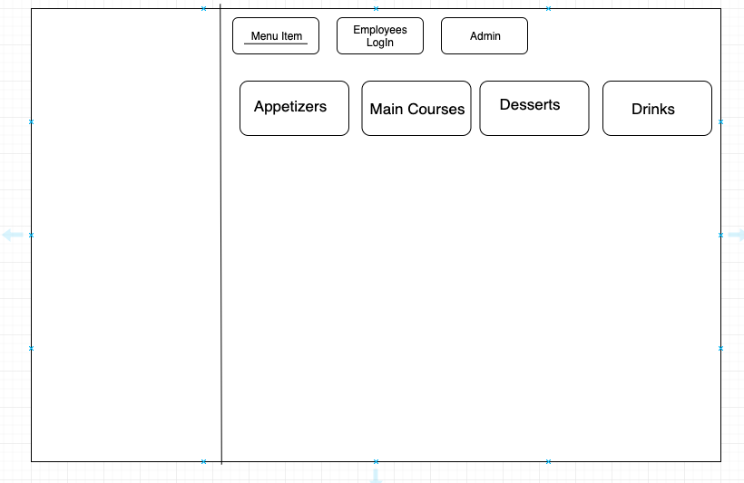
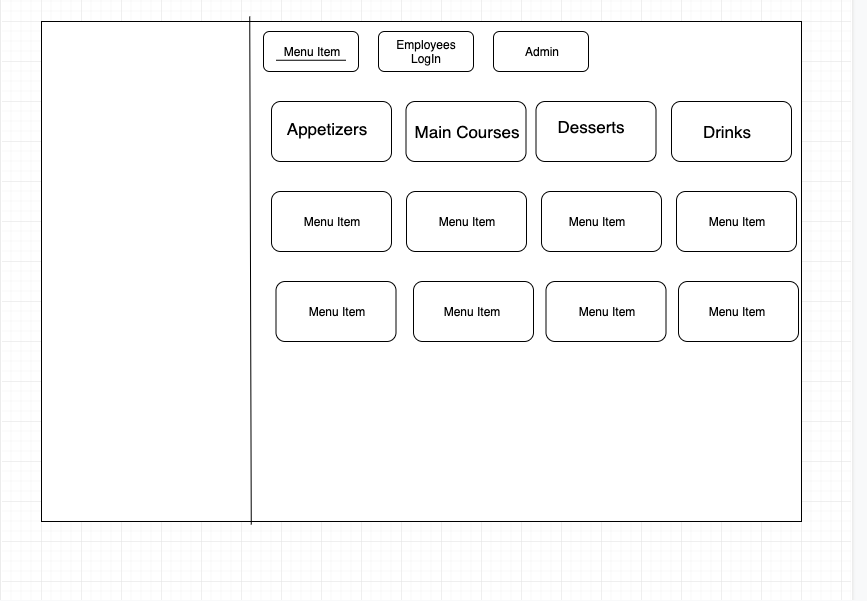
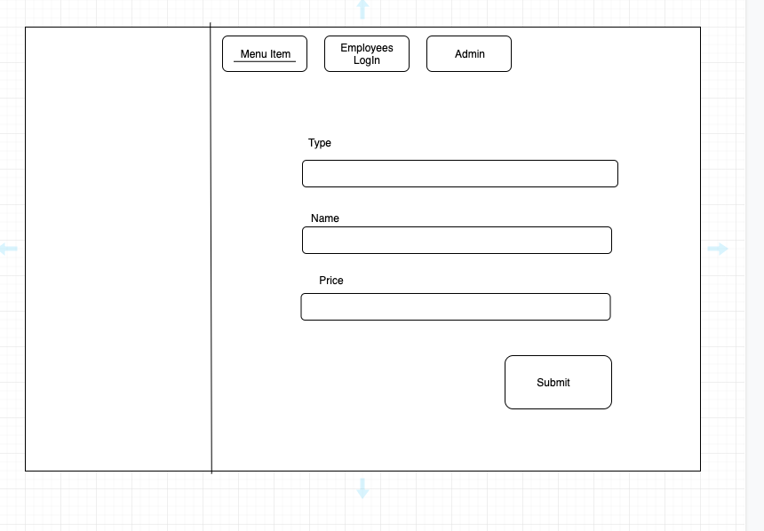
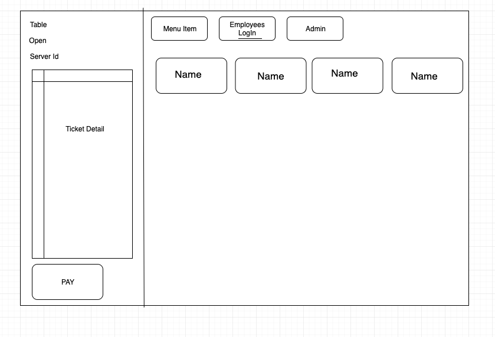
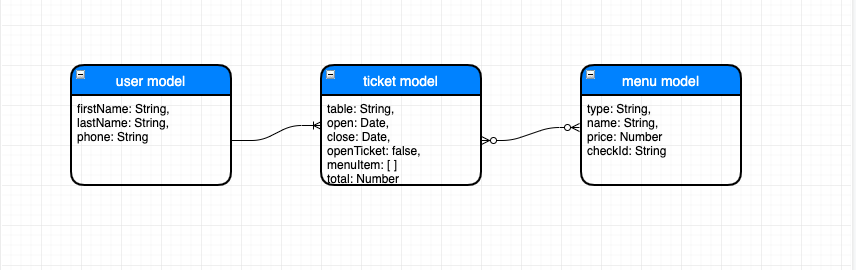

# PROJECT #4: POS SYSTEM

## Overview
For project #4, I decide to challenge my self and pick a restaurant POS system with many to many relationship models which I always wanted to learn how to work with. My app is created for server use in the restaurant which can create user account and take the order from the customer, in order to send ticket to the kitchen or checkout payment.
## Technologies Used
    - Django
    - React
    - Python
    - JavaScript
    - Mostly CSS

## Dependencies:
    - Semantic Reacts UI

## Links
- Project Planning:
<a href="https://trello.com/b/nKULAjB5/pos-system" target="_blank">Trello</a>
- Project Hosted:
<a href="https://pos-project4.herokuapp.com/" target="_blank">Heroku</a>

## Features
3 models:                           
- user model           
- ticket model
- menu model 

## Future Improvements
- Create User Authentication
- Dynamically add menu item and render on the same screen
- Add the quantity of the items
- Using a third party API like Square or Stripe for payment method 

## Wireframe

## ERD
